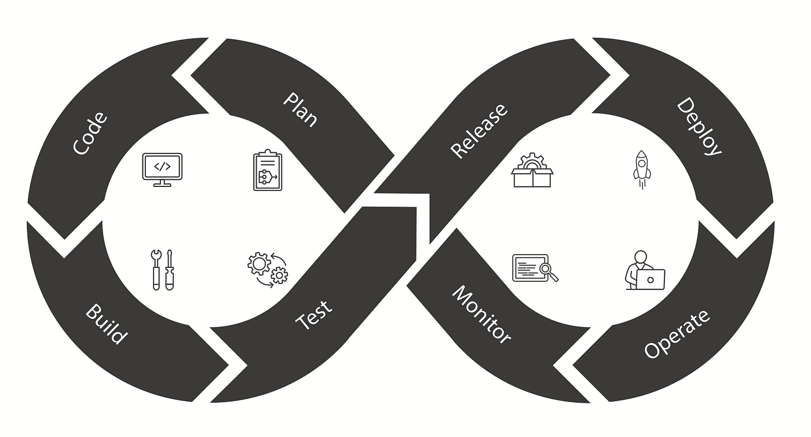
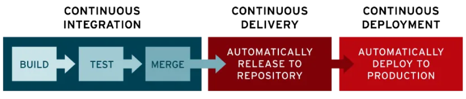
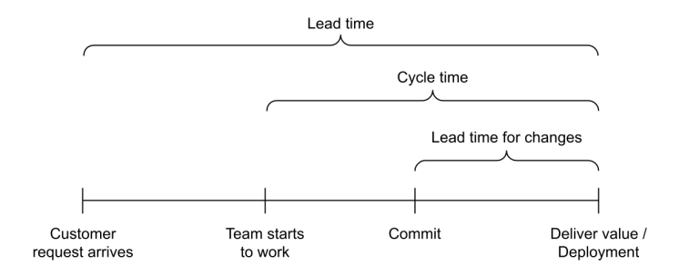

# Introduction to DevOps

Before diving into MLOps, it is essential to understand the principles and practices of DevOps, as they serve as the foundation for implementing effective machine learning projects within a microservices ecosystem. In this module, we will discuss the concept of DevOps, which is fundamental to understanding its role in the broader context of software development and operations.

## What is DevOps?

### Definitions
There are various definitions of DevOps from both industry and academia that, while differing in phrasing, convey similar core concepts:

**Industry Perspectives:**
- DevOps is a set of practices and tools that combines software development (Dev) and IT operations (Ops). It aims to shorten the systems development life cycle and provide continuous delivery with high software quality. DevOps is complementary to Agile software development; many aspects of DevOps have emerged from the Agile way of working. (Wikipedia)
- DevOps is the combination of cultural philosophies, practices, and tools that increases an organization’s ability to deliver applications and services at high velocity. (AWS)
- DevOps is a set of practices, tools, and a cultural philosophy that automates and integrates the processes between software development and IT teams, emphasizing team empowerment, cross-team communication, and technology automation. (Atlassian)
- DevOps is a combination of software developers (Dev) and operations (Ops). It is defined as a software engineering methodology that aims to integrate the work of software development and operations teams by facilitating a culture of collaboration and shared responsibility. (GitLab)

**Academic Perspectives:**
- DevOps is a collaborative and multidisciplinary organizational effort to automate the continuous delivery of new software updates while guaranteeing their correctness and reliability. (Leite et al, 2020)
- It represents an organizational shift in which cross-functional teams work on continuous operational feature deliveries, rather than siloed groups performing functions separately. (Ebert et al, 2016)
- DevOps is a development methodology aimed at bridging the gap between Development (Dev) and Operations (Ops), emphasizing communication and collaboration, continuous integration, quality assurance, and automated deployment through a set of development practices. (Jabbari et al, 2016)

### Summary
These definitions illustrate that DevOps is characterized by a blend of practices, cultural shifts, and tools aimed at fostering collaboration between development and operations teams, ultimately leading to more efficient software delivery and higher quality outcomes.

## Key Principles of DevOps

DevOps is characterized by several key principles that guide its implementation and effectiveness:

### 1. Continuous Integration (CI)
Continuous Integration (CI) is a core practice in software development, focused on the frequent and automatic integration of code changes into a shared repository. This approach allows team members to collaborate efficiently, ensuring that changes are integrated into a common version control system at least once a day.

For each integration, automated tests are executed in an environment as close as possible to the production environment. This ensures the quality of changes and verifies that the system functions correctly. CI facilitates the rapid identification and resolution of integration issues, accelerating the software release process.

### 2. Continuous Delivery (CD)
Continuous Delivery (CD) is an extension of Continuous Integration that ensures the code is always in a releasable state. This process allows for rapid and frequent software updates, enhancing responsiveness to user needs. The process involves two primary stages: first, code changes are integrated and tested; then, they are prepared for distribution. Although CD automates the preparation for release, it differs from Continuous Deployment, which pushes updates directly into production without manual intervention.

The core objective of CD is to minimize the cost, time, and risk of delivering incremental software versions. It focuses on the steps that occur between when a change is committed and when it is ready for deployment to users. By maintaining a codebase that is always ready for release, organizations can streamline the deployment process.

### 3. Continuous Deployment (CD)
Continuous Deployment takes the concept of Continuous Delivery a step further by automating the entire process, including releasing updates directly into the production environment without any manual approval. This practice reduces delays between code integration and deployment, ensuring new features or bug fixes reach users in near real-time.

Continuous Deployment relieves operational teams from manual release tasks, facilitating rapid iteration and faster user feedback. However, this approach relies heavily on robust automated testing, as there are no manual checks before updates are deployed. Although the initial investment in automated testing infrastructure can be high, the long-term benefits include faster and safer releases, leading to increased productivity.

### 4. Continuous Testing
This practice includes automated, scheduled, and continuous code tests during the writing or updating of application code. Such tests can speed up the delivery of code to production.

#### Unit Tests
Unit tests allow developers to verify the correctness of the source code and should be executed as one of the first steps in the CI/CD pipeline. Developers are required to write tests for green path cases, problematic inputs, and known edge cases. During the writing of these tests, developers can simulate expected inputs and outputs.

#### Integration Tests
Integration tests verify that communication between two components occurs correctly. These tests simulate expected inputs and outputs and represent one of the first steps in a CI/CD pipeline before deployment to any environment. Typically, these tests require more extensive simulation activities compared to unit tests to ensure proper functioning.

#### System Tests
System tests verify the end-to-end performance of the system and ensure that it operates as expected in every environment. These tests simulate the input that a component might receive and execute the system. They then check that the system returns the necessary values and correctly updates other parts of the system. These tests should be executed after deployment in each environment.

### 5. Automation
Automation is a critical DevOps practice that streamlines the software development lifecycle. By automating processes such as testing, integration, and deployment, developers have more time to focus on writing code and developing new features. Automation is central to the CI/CD pipeline, reducing human errors and boosting team productivity. Short iteration cycles made possible by automation enable teams to respond quickly to user feedback.

### 6. Infrastructure as Code (IaC)
This practice can be used during the various DevOps phases to enable the automation of infrastructure management and provisioning through code, ensuring consistency, repeatability and speed in the creation and modification of environments, thus facilitating collaboration between development and operations teams.

### 7. Monitoring and Feedback
Monitoring applications and gathering feedback from customers and users are essential for identifying and resolving issues quickly. Feedback loops help inform future development decisions, ensuring continuous improvement of the software.

### 8. Collaboration, Communication, and Shared Responsibility
Collaboration between development and operations teams is at the heart of DevOps. These teams merge into a single functional unit, working together throughout the entire application lifecycle, from planning to release. This close collaboration is built on open and continuous communication, shared feedback, and joint responsibility for delivering quality results.
DevOps team members are responsible for the entire product lifecycle, including both front-end and back-end tasks. This comprehensive involvement leads to higher-quality outcomes and breaks down silos between different business functions.

### 9. Continuous Improvement
Continuous improvement focuses on experimentation, reducing waste, and optimizing the speed, cost, and ease of software releases. This principle, closely tied to continuous delivery, allows DevOps teams to frequently push updates that enhance system efficiency.

## Advantages of DevOps

### 1. Improved Collaboration and Communication
The DevOps methodology removes the barriers between development and operations teams, fostering closer collaboration. This leads to greater sharing of feedback and responsibilities, creating a culture of transparency and trust. Team collaboration reduces downtime, accelerates problem resolution, and facilitates the release of higher-quality software.

### 2. Faster Release Cycles
Thanks to automation practices and continuous integration, teams that adopt DevOps can perform faster and more frequent releases. This enables a quicker delivery of new features or bug fixes, allowing teams to respond rapidly to customer needs without compromising software quality.

### 3. Higher Code Quality
DevOps promotes system thinking and automated testing, ensuring that each change is thoroughly tested before being released into production. Teams that utilize DevOps tend to deliver more stable releases and reduce the number of errors, improving the overall quality of the product.

### 4. Reduced Mean Time to Resolution (MTTR)
One of the key aspects of DevOps is transparency and constant communication between teams. This reduces the mean time to resolution (MTTR) for issues, thanks to faster feedback and better handling of critical tickets. The ability to quickly resolve incidents improves service continuity and customer satisfaction.

### 5. Increased Automation and Efficiency
Automation is a key component of DevOps. By automating testing, building, and deployment processes, teams can focus more on developing new features rather than on repetitive manual tasks. This increase in operational efficiency allows for a continuous workflow with fewer interruptions.

### 6. Better Management of Unplanned Work
With clear prioritization and greater visibility into processes, DevOps allows for better management of unplanned work. Teams can more easily adapt to unexpected tasks without sacrificing productivity and progress on planned work, reducing stress and improving overall efficiency.

### 7. Continuous Innovation
Thanks to continuous feedback integration and the ability to perform frequent releases, DevOps supports continuous innovation within organizations. Companies can experiment with new ideas more rapidly and adapt to market demands, maintaining a competitive edge.

### 8. Scalability and Reliability
The DevOps infrastructure allows for flexible scalability and increased system reliability through practices such as continuous monitoring and automated testing. This enables teams to handle the challenges of growth without sacrificing software performance or stability.

### 9. Security (DevSecOps)
Security is increasingly becoming an integral part of DevOps practices, giving rise to the concept of DevSecOps. DevSecOps ensures that security is embedded in every phase of the DevOps lifecycle, rather than being an afterthought. This practice integrates automated security checks and policies into the CI/CD pipeline, ensuring that vulnerabilities are detected early and resolved quickly.

**Example tools**: SonarQube, Snyk, Aqua Security for automated security testing and vulnerability scanning.

## Lifecycle

The DevOps lifecycle represents a continuous flow of activities combining software development, testing, implementation and monitoring. Each phase of the lifecycle is characterised by automation, collaboration and continuous integration, ensuring an efficient flow from planning to implementation and product monitoring.

Below is an overview of the main phases of the DevOps lifecycle, enriched by the tools used in each phase to optimise the process.

## DevOps Lifecycle: Phases and Toolchain

### 1. Planning
In this phase, the business value and requirements are defined. Teams establish the project goals and identify the necessary elements for the upcoming release.  

**Example tools**: Jira, Git for issue tracking and project management.

### 2. Coding
The coding phase involves designing and developing the software, where developers create and update the source code.  

**Example tools**: GitHub, GitLab, Bitbucket, Stash for source code management and version control.

### 3. Build
In this phase, software builds and versions are managed and automatic tools are used to compile and package the code for the next release sent to production. Code repositories or source package repositories are used, which also include the infrastructure required for the product release.

**Example tools**: Docker, Ansible, Puppet, Chef, Gradle, Maven, JFrog Artifactory for build automation and version management.

### 4. Testing
This phase involves continuous testing to ensure the software is bug-free and ready for production. Tests can be automated or manual.

**Example tools**: JUnit, Codeception, Selenium, Vagrant, TestNG, BlazeMeter for automated and manual testing of code quality.

### 5. Deployment
In the deployment phase, the software is distributed to production environments. DevOps tools automate the deployment process to ensure repeatability and reliability.  

**Example tools**: Puppet, Chef, Ansible, Jenkins, Kubernetes, OpenShift, OpenStack, Docker, Jira for release automation and coordination.

### 6. Operations
This phase is focused on managing the software in production. Automation tools support continuous system maintenance.

**Example tools**: Ansible, Puppet, PowerShell, Chef, Salt, Otter for operational management and system maintenance.

### 7. Monitoring
In the monitoring phase, the software’s performance is analyzed to identify any issues and ensure system stability.

**Example tools**: New Relic, Datadog, Grafana, Wireshark, Splunk, Nagios, Slack (for monitoring system health and performance).

## Key Metrics

DevOps metrics are data points that directly reveal the performance of a DevOps pipeline and help identify bottlenecks. These metrics enable DevOps teams to track progress in achieving high-level goals, including faster release cycles and improved application performance.

### 1. Lead Time for Changes
Lead time measures the period between a code commit and the point where it is ready for production (passes tests and reviews). High-performance teams typically measure lead times in hours, whereas low-performance teams may take days or weeks.

Key practices to improve lead time include test automation, trunk-based development, and working in small batches. These ensure quick feedback and the ability to address defects early.

### 2. Change Failure Rate
This metric tracks the percentage of deployments that require quick fixes or rollbacks after production. High-performance teams aim for a rate of 0% to 15%.

Practices such as test automation and trunk-based development are correlated with reduced failure rates, as they simplify identifying and fixing defects early in the process.

### 3. Deployment Frequency
This measures how often teams deploy updates to production. High-performance teams can deploy multiple times a day, while low-performance teams may deploy weekly or monthly.

Frequent deployments require an automated pipeline that includes testing, feedback mechanisms, and minimizes manual intervention.

### 4. Mean Time to Recovery (MTTR)
MTTR measures the time it takes to recover from production incidents or failures. High-performance teams typically recover in under an hour, while low-performance teams may take days.

Quick recovery relies on continuous monitoring, alerting systems, and the ability to rapidly deploy fixes or roll back problematic changes.

